## Part 1. Инструмент ipcalc
1. Сети и маски

- Адрес сети 192.167.38.54/13 = 192.160.0.0
- Маска 255.255.255.0 = /24 = 11111111.11111111.11111111.00000000
- Маска /15 = 255.254.0.0 = 11111111.11111110.00000000.00000000
- Маска 11111111.11111111.11111111.11110000 = /28 = 255.255.255.240

- Минимальный и максимальный хост для адреса 12.167.38.4/8 = 12.0.0.1 - 12.255.255.254
- Минимальный и максимальный хост для адреса 12.167.38.4/16 = 12.167.0.1 - 12.167.255.254
- Минимальный и максимальный хост для адреса 12.167.38.4/23 = 12.167.38.1 - 12.167.39.254
- Минимальный и максимальный хост для адреса 12.167.38.4/4 = 0.0.0.1 - 15.255.255.254

2. localhost

- Под localhost зарезервирована сеть 127.0.0.0/8, поэтому обратиться можно только с адресов  127.0.0.2 и 127.1.0.1

3. Диапазоны и сегменты сетей

- Частные: 10.0.0.45, 10.10.10.10, 172.20.250.4, 172.16.255.255, 192.168.4.2, публичные: 134.43.0.2, 172.0.2.1, 192.172.0.1, 172.68.0.2, 192.169.168.1

- Возможные адреса: 10.10.0.2, 10.10.10.10, 10.10.100.1

## Part 2. Статическая маршрутизация между двумя машинами

- 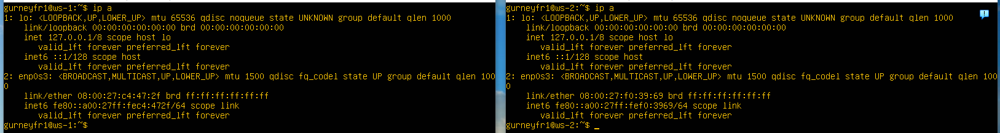
- 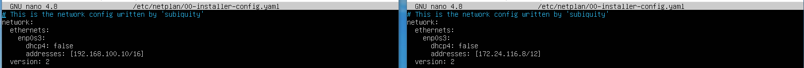
- 

1. 
- 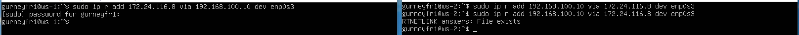
- 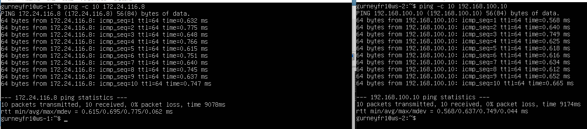

2. 
- 
- 

## Part 3. Утилита iperf3

1. 
- 8 Mbps = 1 MB/s
- 100 MB/s = 100000 Kbps
- 1 Gbps = 1000 Mbps
2. 
- 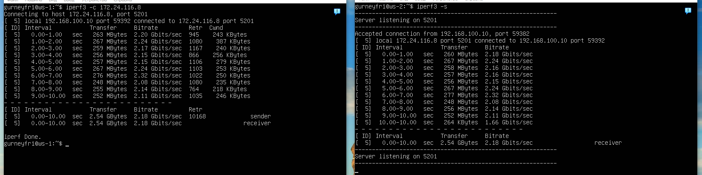
- 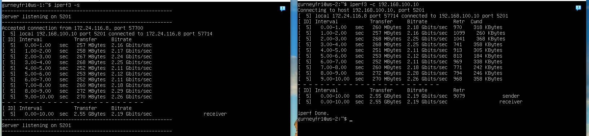

## Part 4. Сетевой экран
1. 
- 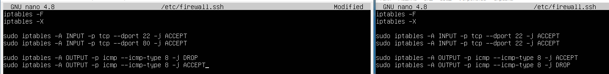
- 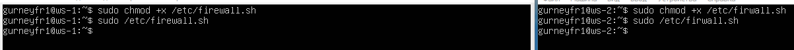
- Разница между стратегиями, применёнными в первом и втором файлах, в том, что всегда в приоритете первое правило. Машина ws1 первым правилом блокирует все исходящие пакеты протокола ICMP типа 8 (ICMPv4 echo request). Машина ws2 первым правилом разрешает прохождения пакетов протокола ICMP типа 8.

2. 
- 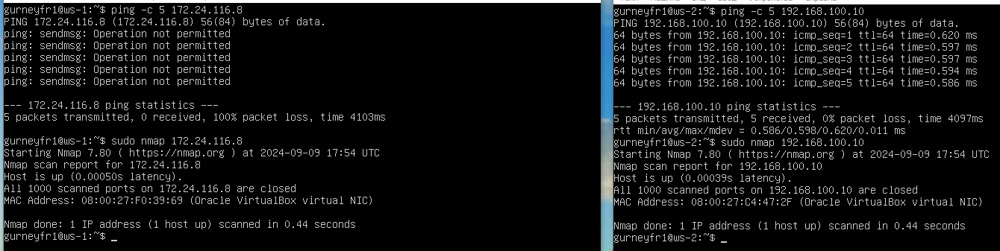

## Part 5. Статическая маршрутизация сети

1. 
- 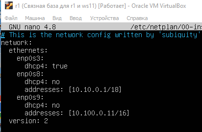
- 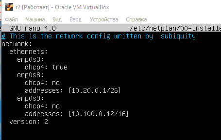
- 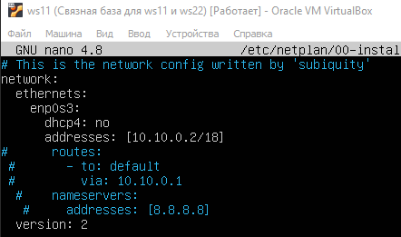
- 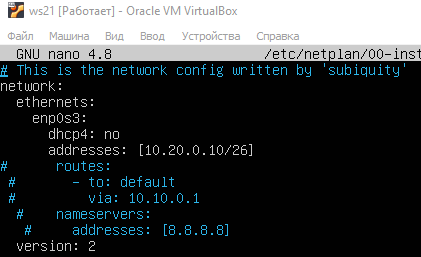
- 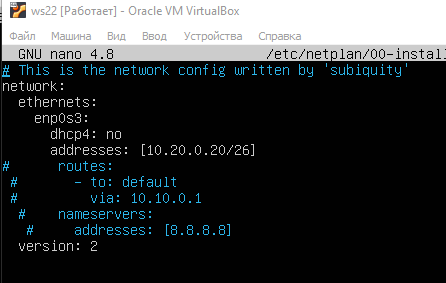

- 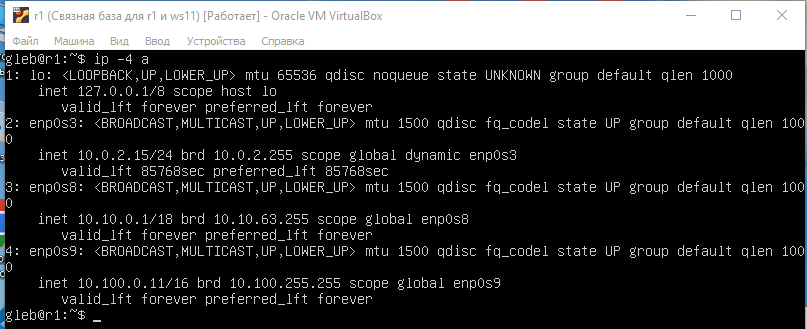
- 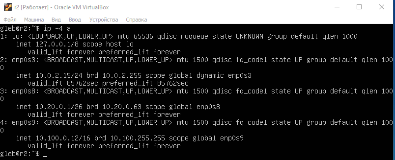
- 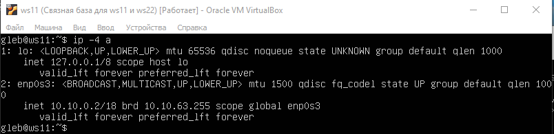
- 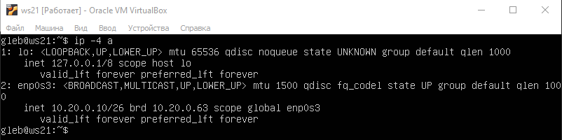
- 

- 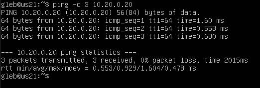
- 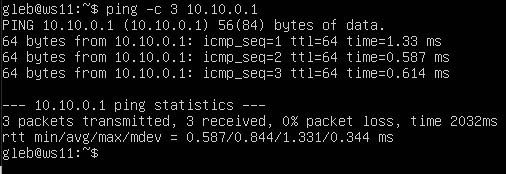

2. 
- 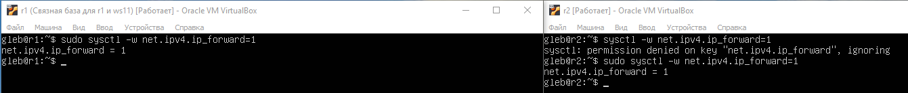
- 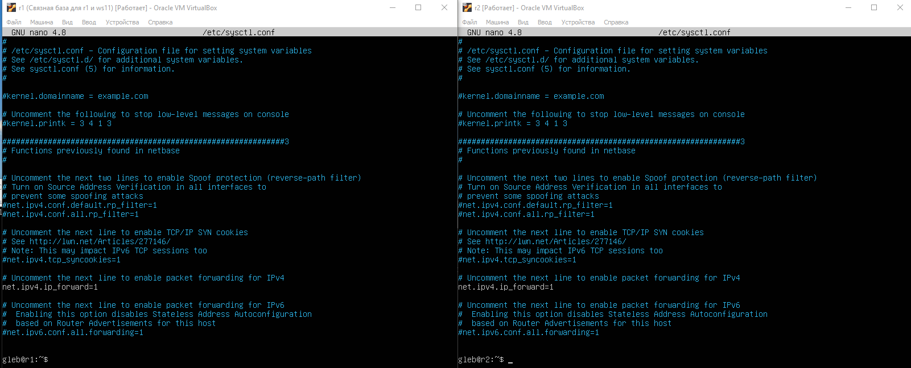

3. 
- 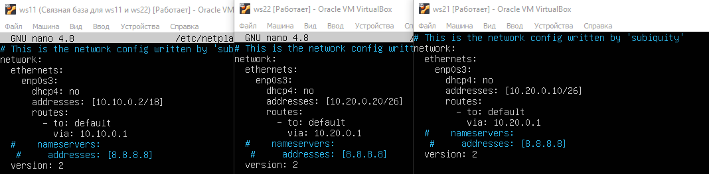
- 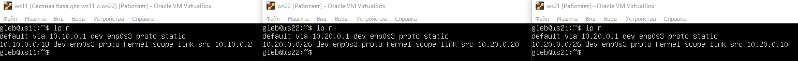
- 

4. 
- 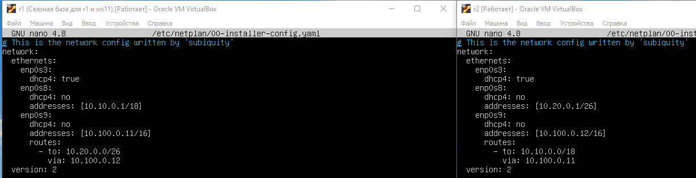
- 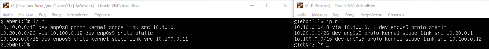
- 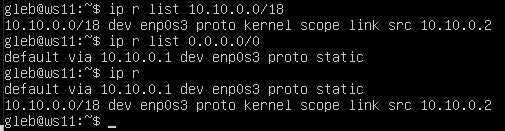
- Маршрут 10.10.0.0/18 не является маршрутом по умолчанию так как для него уже определен конкретный маршрут в таблице маршрутизации 

5. 
- 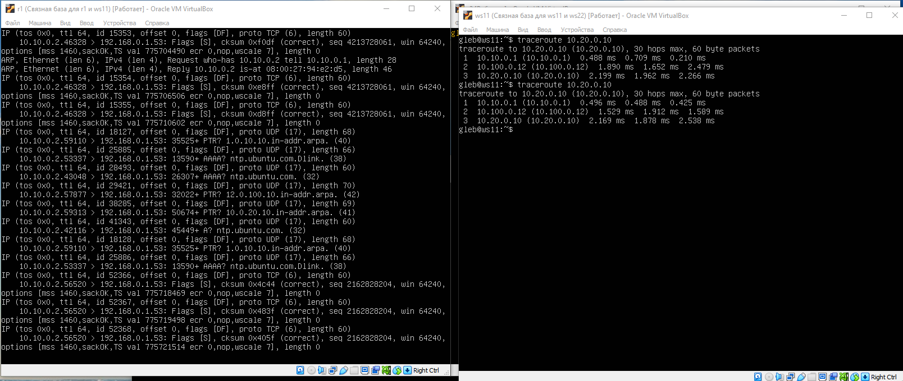
- Команда traceroute linux использует UDP пакеты. Она отправляет пакет с TTL=1 и смотрит адрес ответившего узла, дальше TTL=2, TTL=3 и так пока не достигнет цели. Каждый раз отправляется по три пакета и для каждого из них измеряется время прохождения. Пакет отправляется на случайный порт, который, скорее всего, не занят. Когда утилита traceroute получает сообщение от целевого узла о том, что порт недоступен трассировка считается завершенной.

6. 
- 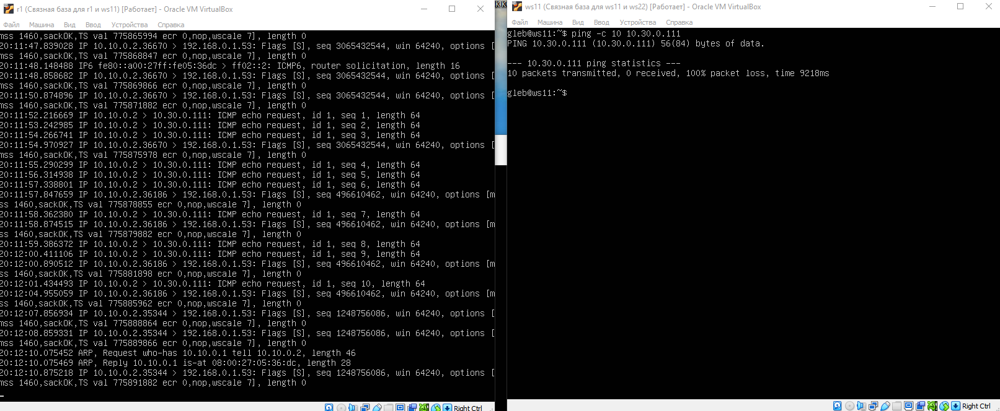

## Part 6. Динамическая настройка IP с помощью DHCP

1. 
- 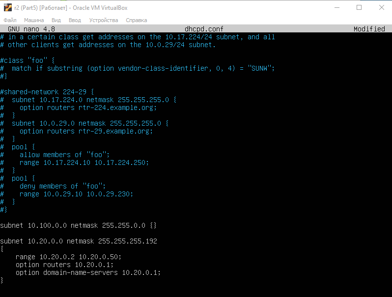

2. 
- 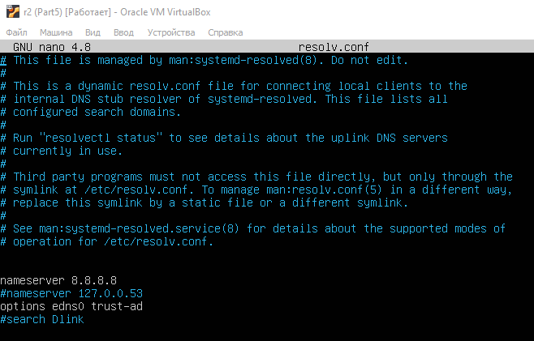
- 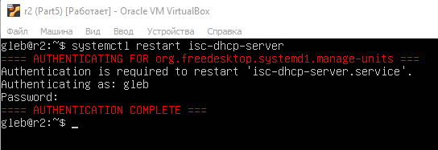
- 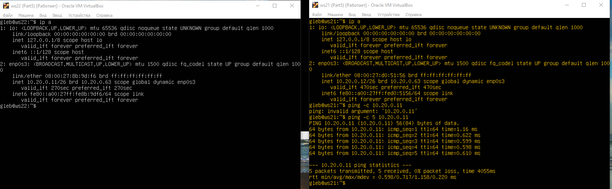
- 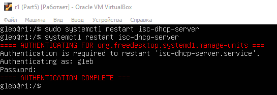
- 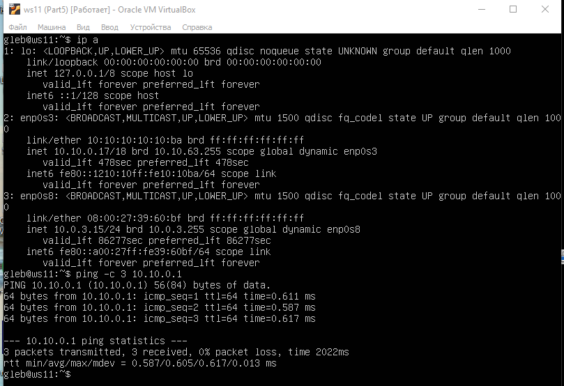
- 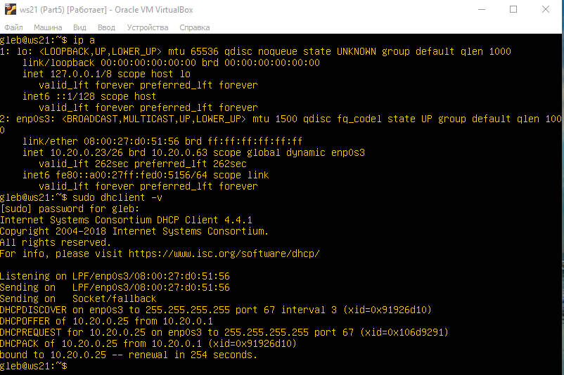
- 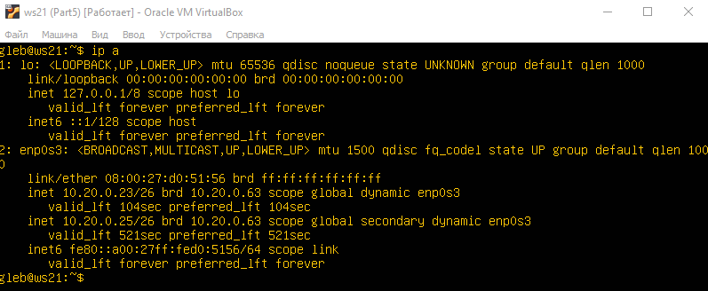

- sudo dhclint -v - запрашивает новый ip-адрес и выводит дополнительную информацию
- sudo dhclint -r - освобождает текущий ip-адрес

## Part 7. NAT

1. 
- 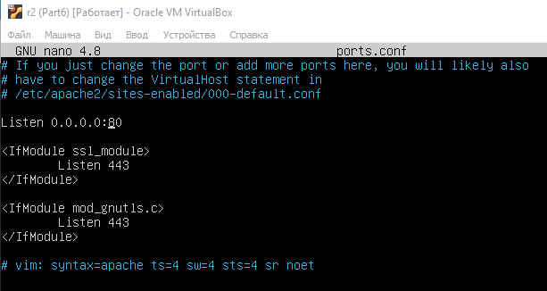
- 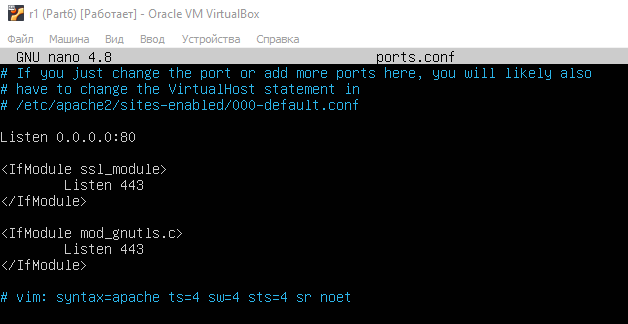
- 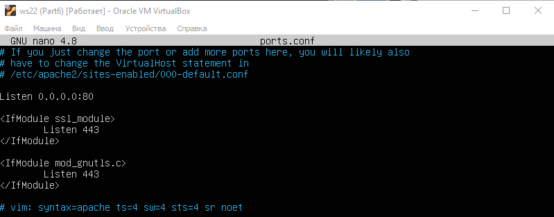
- 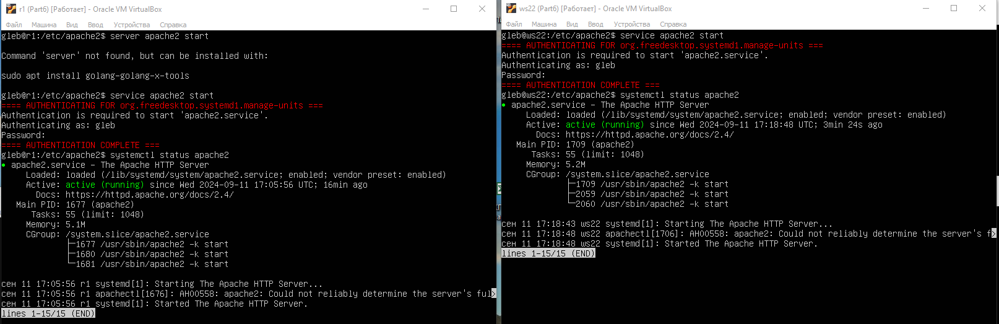
- 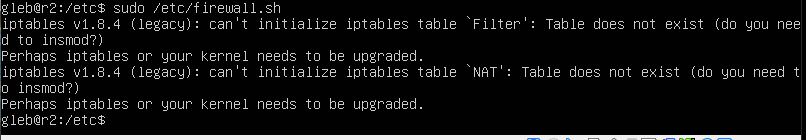
- 
- 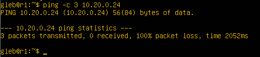
- 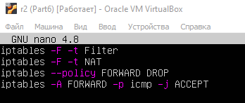
- 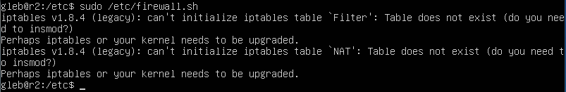
- 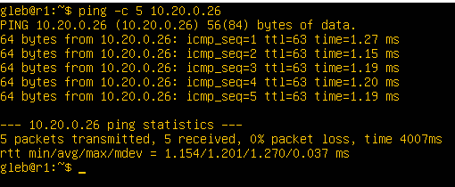
- 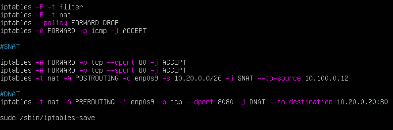
- 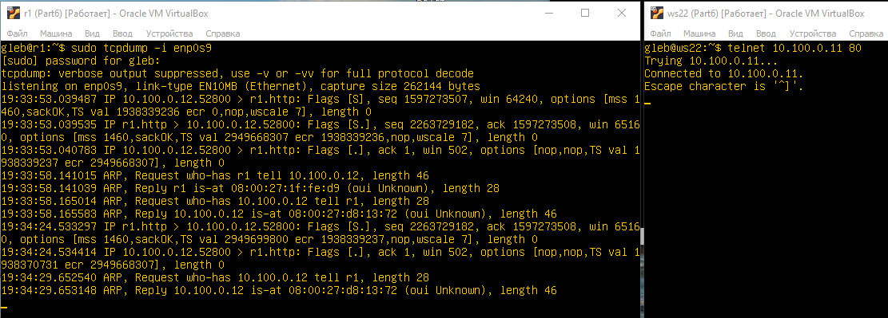
- 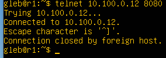

## Part 8. Дополнительно. Знакомство с SSH Tunnels

- 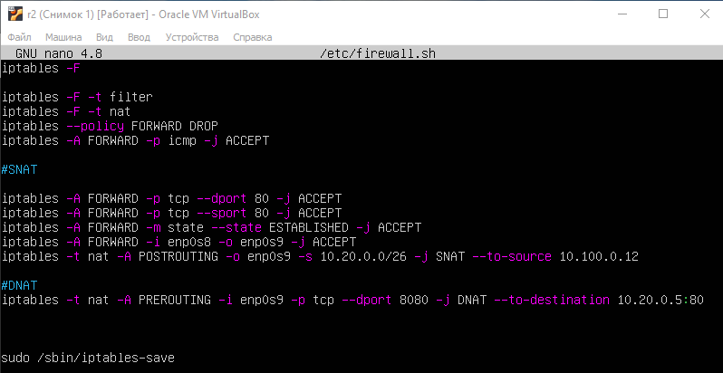
- 

1. 
- Команда sudo ssh -L 8888:127.0.0.1:80 10.20.0.3
- 
- 

2. 

- Команда sudo ssh -R 8080:localhost:80 10.20.0.17
- 
- 

