## Part 1. Готовый докер

1. 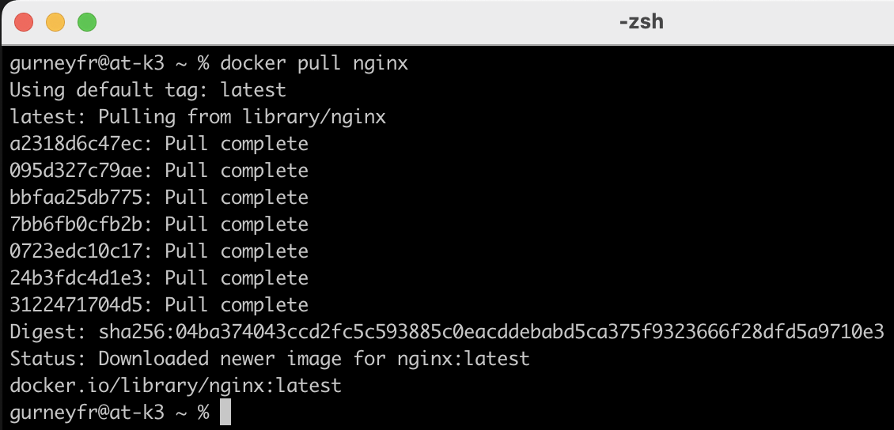

2. 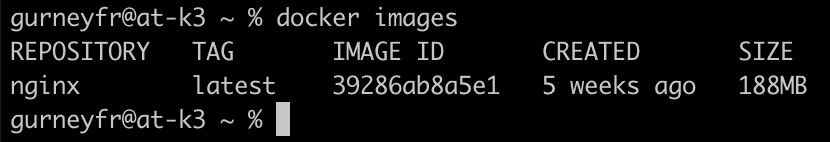

3. 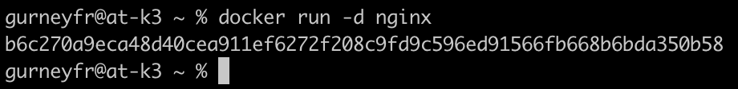

4. 
- 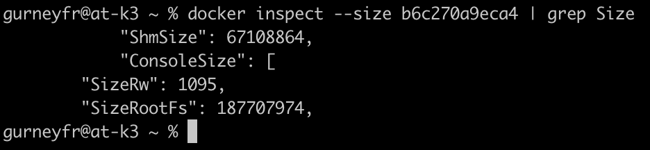
- SizeRw — это размер, занимаемый контейнером для записываемых данных. Он включает в себя все изменения, которые были внесены в файловую систему контейнера после его создания, такие как новые файлы, изменения существующих файлов и т.д.

- SizeRootFs — это общий размер всей файловой системы контейнера. Этот параметр включает в себя размер всех слоёв образа, из которого был создан контейнер, а также все изменения, внесённые в контейнер (то есть, SizeRw + размер слоёв образа).
- 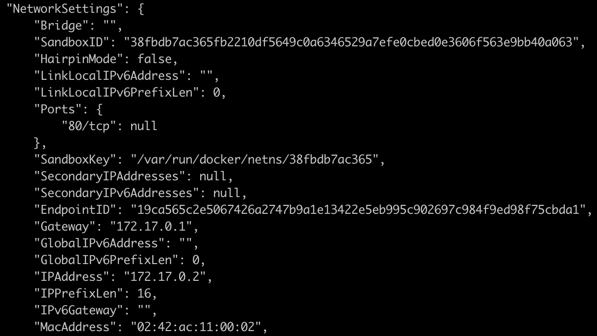

5. 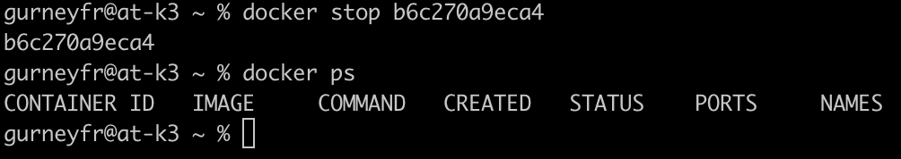

6. 
- 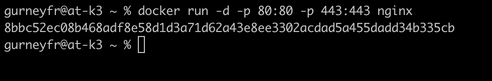
- 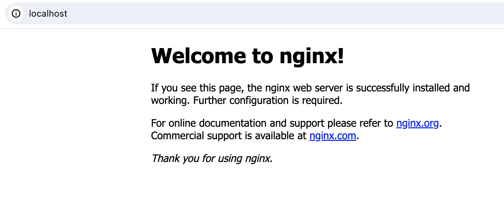

7. 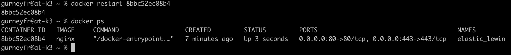

## Part 2. Операции с контейнером

1. 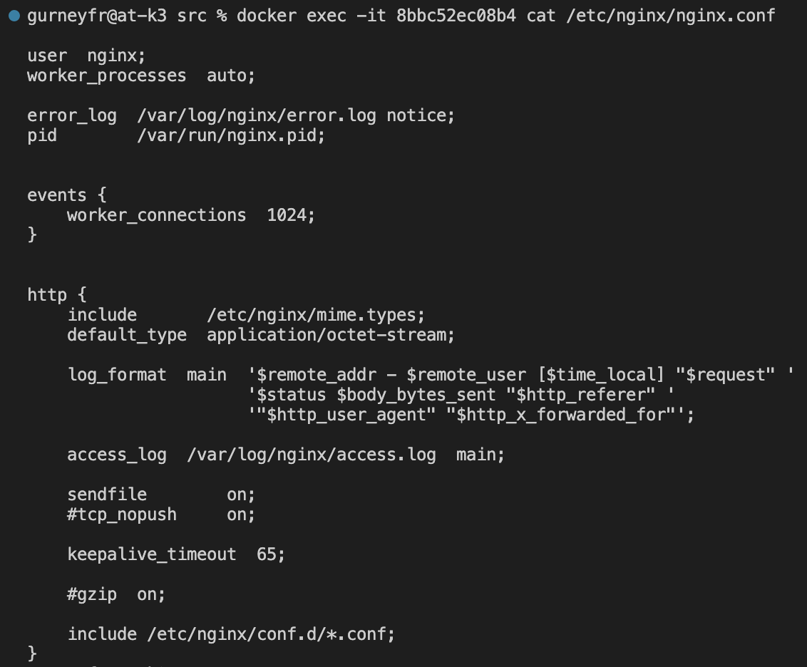
2. 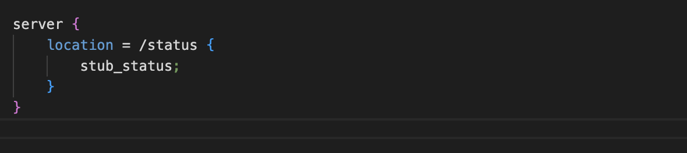
3. 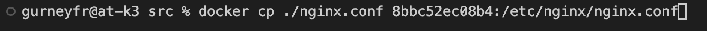
4. 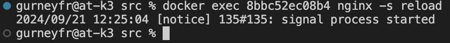
5. 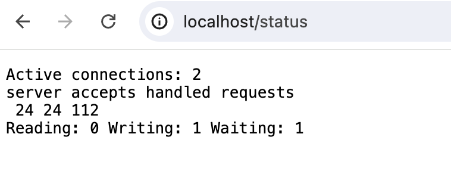
6. 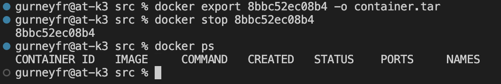
7. 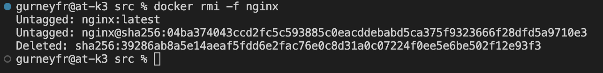
8. 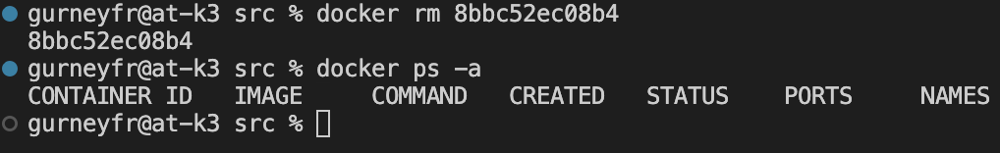
9. 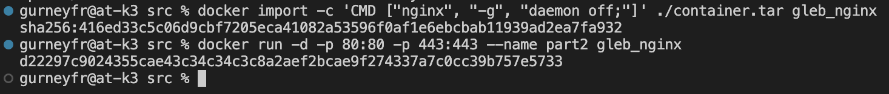
10. 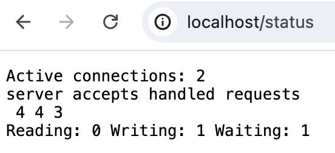

## Part 3. Мини веб-сервер

1. 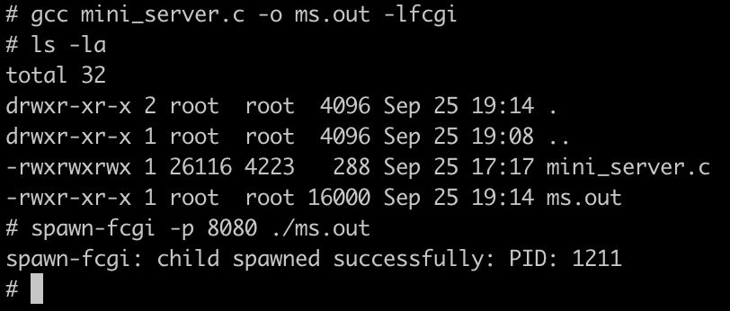
2. 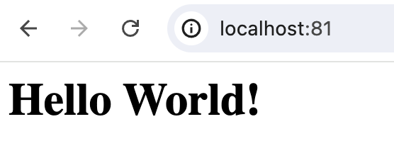

## Part 4. Свой докер

1. 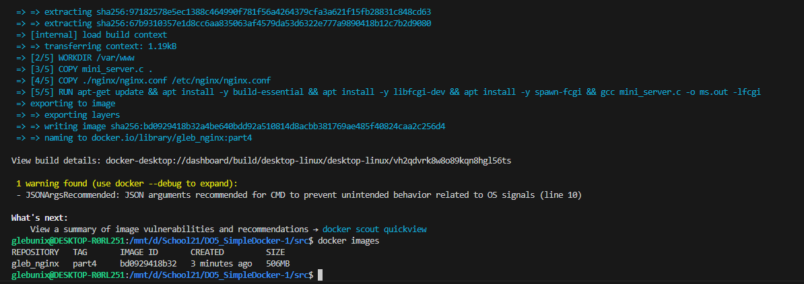
2. 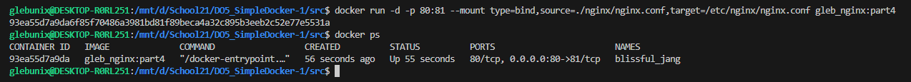
3. 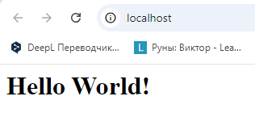
4. 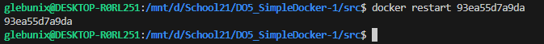
5. 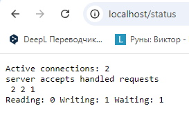

## Part 5. Dockle

- Файлы приложены в src

## Part 6. Базовый Docker Compose

1. 
2. 